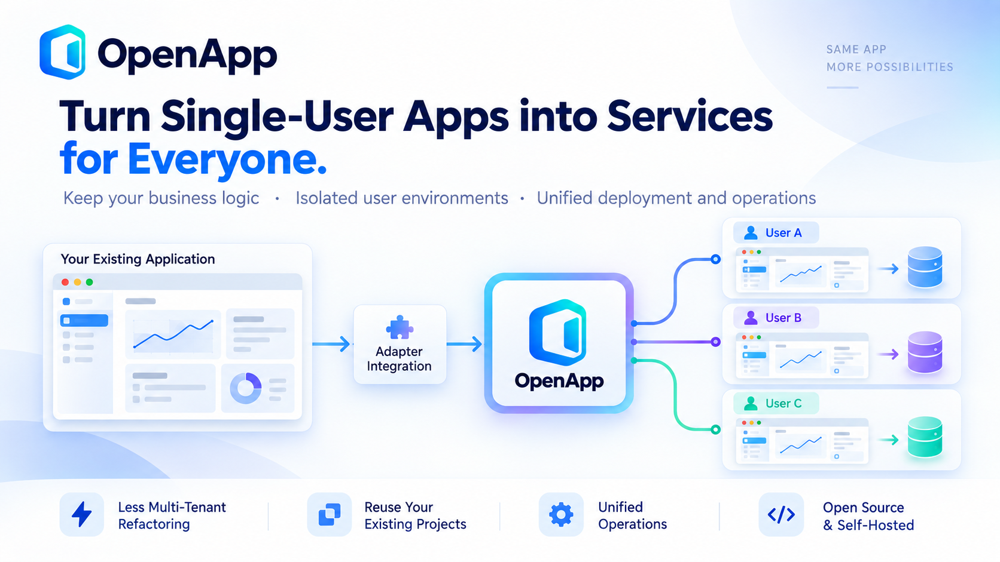

  
  <h1>OpenApp</h1>
  
<strong>One app. An independent environment for every user.</strong>

  
Keep your single-user business logic. Deliver it to teams and customers.

  

    
    
    
    
  

  

    English · <a href="README.zh-CN.md">简体中文</a> ·
    <a href="docs/README.en.md">Docs</a> ·
    <a href="docs/getting-started.en.md">Getting started</a> ·
    <a href="CONTRIBUTING.md">Contributing</a> ·
    <a href="docs/support-matrix.en.md">Support matrix</a>
  

  

---

## Keep building your app, without maintaining a second SaaS architecture

Many Web apps, AI agents and developer tools are designed around one person's workspace, configuration and data. A desktop client and a Web version may even share the same business code.

Offering that application to a team or to customers can turn into another project: redesign the backend for multiple tenants, add accounts and permissions, separate user data, and build deployment and instance management. Developers can end up maintaining both a single-user product and a SaaS architecture—or staffing a separate platform team.

**OpenApp adds multi-user access around your application, with an independent runtime environment and persistent workspace for each user.** For suitable applications, you can keep the single-user business logic and put the integration in an Adapter.

## What your users get

Imagine you build an AI coding workspace with a Web interface. Alice and Bob sign in through OpenApp and launch the same application image. Each gets a separate instance with their own agent state, terminal, files and configuration. OpenApp checks workspace ownership before routing requests; application restarts retain each workspace's persistent data.

Your application continues to work with one user's environment. OpenApp manages the accounts, environment allocation, access, deployment and upgrades across those independent instances.

## What you avoid rebuilding

- **A separate multi-tenant business backend.** Keep improving the same application for personal and hosted use, reducing duplicated development and platform staffing costs.
- **An operations console for every project.** Reuse account management, access control, instance start/stop, task records and diagnostics through the management UI and CLI.
- **A deployment process tied to your source layout.** An Adapter declares the app's build inputs and startup requirements. It does not have to use a fixed frontend/backend package pair.
- **Manual assembly on every server.** Compose Core and selected Adapters into a compiled deployment directory with Dockerfiles, configuration and integrity checks; build the Linux images on the server.
- **A platform release for every app update.** Update application images separately, test candidates before activation, and use resource limits and idle stopping to manage capacity.

Core, Adapters and business applications remain independently maintained. OpenApp is self-hosted and licensed under Apache-2.0.

## Separate the application from the execution platform

The Adapter describes how an application integrates with OpenApp. Runtime/Provider interfaces describe how to create, start, stop and access its environment. This separation lets execution platforms evolve without putting infrastructure-specific management into your business code.

**Docker is implemented today, including local development with OrbStack.** Kubernetes (K8s), Daytona and additional runtimes are expansion directions; they are not bundled, supported Providers yet. Each new Provider will need implementation and lifecycle testing against the public contracts.

## Connect your application

1. **Package the app:** provide a containerized Web app or HTTP service and identify the files that must persist.
2. **Write an Adapter:** describe its image or build inputs, startup, health checks, storage and any authentication handoff.
3. **Compose and deploy:** combine the Adapter with Core, deploy the directory, and verify two users can work independently.

This fits personal Web tools, AI workspaces, internal services and desktop projects that also expose a deployable Web/service version. The current workspace contract runs one application container with one HTTP entry. A desktop GUI alone is not sufficient; shared external databases, object storage and credentials still need application-specific isolation. See [integration requirements](docs/getting-started.en.md#integration-requirements).

[**Follow the tutorial: from a single-user app to two independent user workspaces →**](docs/adapter-tutorial.en.md)

## Links

- [Repository](https://github.com/seekskyworld/openapp)
- [Releases](https://github.com/seekskyworld/openapp/releases)
- [Issues](https://github.com/seekskyworld/openapp/issues)
- [LINUX DO — community discussion](https://linux.do/)
- [Documentation](docs/README.en.md)
- [Getting started](docs/getting-started.en.md)
- [Adapter development](docs/adapter-development.en.md)
- [Composition and deployment](docs/composition-release.en.md)
- [Contributing](CONTRIBUTING.md)
- [Support](SUPPORT.md)
- [Security policy](SECURITY.md)

## License

OpenApp Core, repository packages and the OpenApp Logo are licensed under [Apache License 2.0](LICENSE). Third-party dependencies and independent plugins retain their own licenses; see [third-party notices](THIRD_PARTY_NOTICES.md).

Copyright © 2026 OpenApp Contributors.
