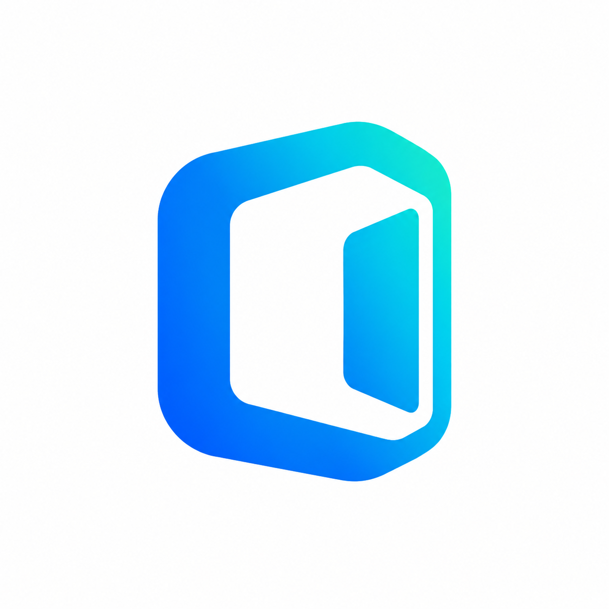
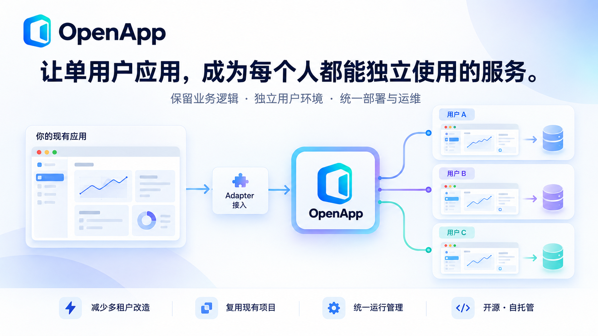

  
  <h1>OpenApp</h1>
  
<strong>同一份应用，每位用户一个独立环境。</strong>

  
保留单用户业务逻辑，把应用交付给团队和客户。

  

    
    
    
    
  

  

    简体中文 · <a href="README.md">English</a> ·
    <a href="docs/README.md">文档</a> ·
    <a href="docs/adapter-tutorial.md">接入你的应用</a> ·
    <a href="CONTRIBUTING.md">参与贡献</a> ·
    <a href="#links">Links</a>
  

  

---

## 专注一套业务代码，不必再维护另一套 SaaS 架构

很多 Web 应用、AI Agent 和开发工具，本来就是围绕一个人的工作区、配置和数据设计的。桌面端与 Web 端还可能共用同一套业务代码。

当产品要交给团队或客户使用时，开发者往往又要开始一个新项目：把后端改成多租户，补上账号与权限，隔离用户数据，再开发部署和实例管理。最后，单用户版本与 SaaS 版本变成了两套需要维护的架构，有时还要为此单独组建平台团队。

**OpenApp 在应用外面提供多用户能力，为每位用户分配独立运行环境和持久工作区。** 对适合这种部署方式的应用，你可以保留单用户业务逻辑，把接入工作集中到 Adapter 中。

## 用户实际得到什么

假设你开发了一个带 Web 界面的 AI 编程工作台。Alice 和 Bob 通过 OpenApp 登录，启动的是同一份应用镜像，但各自拥有独立的实例，以及自己的 Agent 状态、终端、文件和配置。OpenApp 在转发请求前检查工作区归属，应用重启后仍保留各自的持久数据。

业务应用继续处理一个用户环境中的工作，OpenApp 则统一管理这些独立实例的账号、环境分配、访问、部署和升级。

## 少做哪些重复工作

- **少维护一套多租户业务后端。** 个人使用和托管交付继续围绕同一套应用迭代，减少重复开发和额外平台团队的投入。
- **少为每个项目重做运维后台。** 复用账号管理、访问控制、实例启停、任务记录和运行诊断，通过管理页面与 CLI 操作。
- **少受固定工程结构约束。** Adapter 描述构建输入和启动要求，不要求应用一定拆成“前端包 + 后端包”。
- **少在服务器上手工拼装源码。** 开发阶段把 Core 与选定 Adapter 组合编译成部署目录，附带 Dockerfile、配置和完整性校验，服务器据此构建 Linux 镜像。
- **少把业务更新绑在平台发布上。** 应用镜像可以单独更新，候选镜像通过测试再激活；配合资源限制与闲置停止，管理实例容量和运行成本。

Core、Adapter 和业务应用各自维护。OpenApp 采用 Apache-2.0 许可，支持自托管和二次开发。

## 应用接入与底层运行平台分开

Adapter 描述应用如何接入 OpenApp；Runtime/Provider 接口负责环境的创建、启停与访问。底层执行平台可以沿着这组接口扩展，业务代码无需承担不同基础设施的管理逻辑。

**当前已实现 Docker，也可使用 OrbStack 进行本地开发。** Kubernetes（K8s）、Daytona 和更多运行时是后续扩展方向，尚未作为可用 Provider 提供。每一种新增实现都需要按公开接口完成适配和生命周期测试。

## 把你的应用接进来

1. **准备应用：** 提供可容器化运行的 Web 应用或 HTTP 服务，明确哪些文件需要持久保存。
2. **编写 Adapter：** 描述镜像或构建输入、启动方式、健康检查、存储，以及需要时的认证交接。
3. **组合部署：** 将 Adapter 与 Core 组合，部署后验证两个用户能够独立使用。

适合个人 Web 工具、AI 工作台、内部服务，以及已有可部署 Web/服务版本的桌面项目。当前每个工作区支持一个应用容器和一个 HTTP 入口；只有桌面 GUI 的程序不能直接接入，共享的外部数据库、对象存储和凭据仍需按应用做好隔离。详见[适用范围与接入边界](docs/application-integration.md)。

[**跟着教程，接入一个应用并验证双用户独立使用 →**](docs/adapter-tutorial.md)

## Links

- [项目仓库](https://github.com/seekskyworld/openapp)
- [版本发布](https://github.com/seekskyworld/openapp/releases)
- [问题反馈](https://github.com/seekskyworld/openapp/issues)
- [LINUX DO — 社区交流](https://linux.do/)
- [文档中心](docs/README.md)
- [首次安装](docs/first-install.md)
- [Adapter 开发](docs/adapter-development.md)
- [组合编译与部署](docs/composition-release.md)
- [贡献指南](CONTRIBUTING.md)
- [支持渠道](SUPPORT.md)
- [安全政策](SECURITY.md)

## 许可证

OpenApp Core、本仓库子包及 OpenApp Logo 采用 [Apache License 2.0](LICENSE)。第三方依赖与独立插件保留各自许可证，详见[素材与第三方说明](THIRD_PARTY_NOTICES.md)。

Copyright © 2026 OpenApp Contributors.
